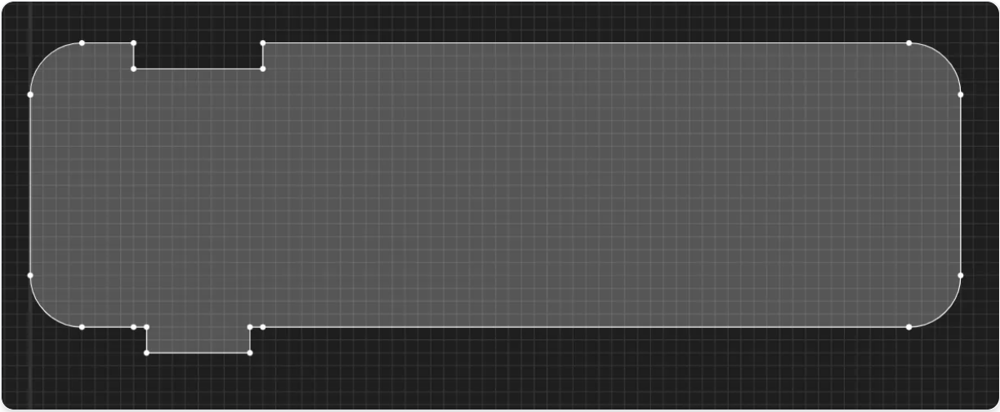
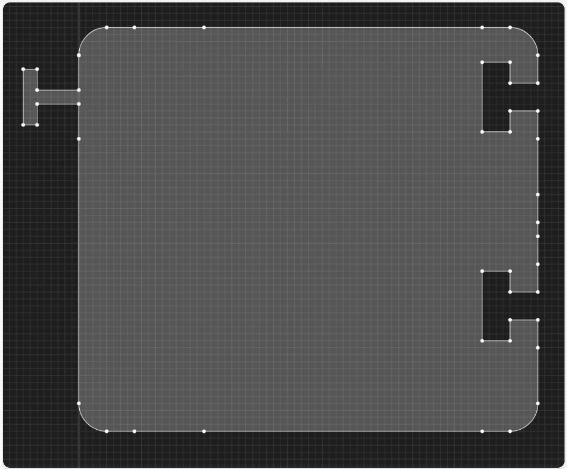
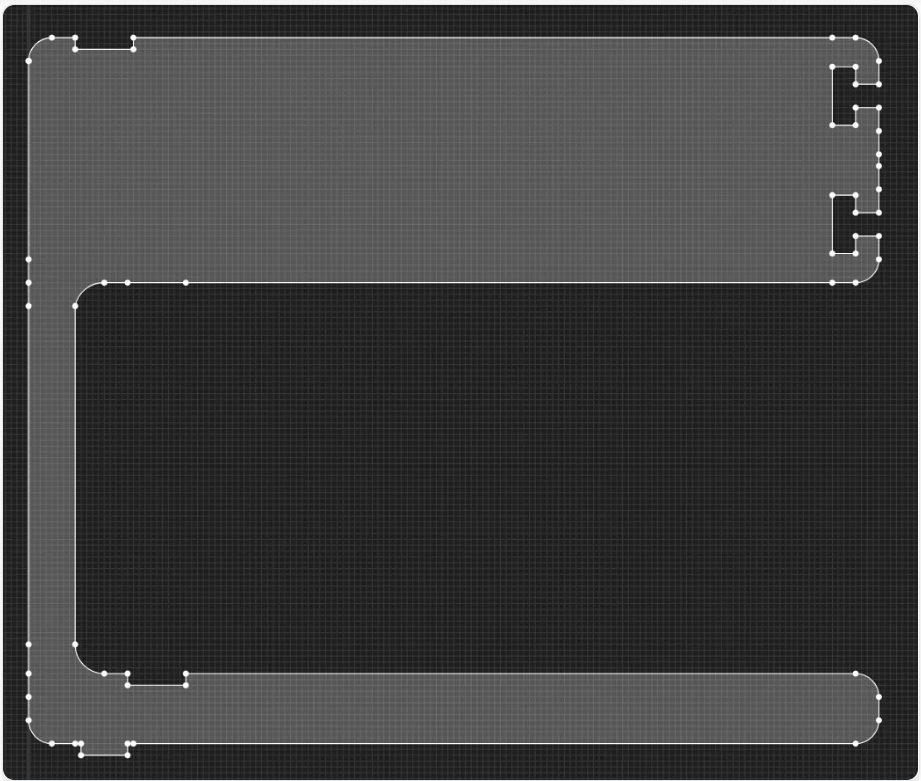
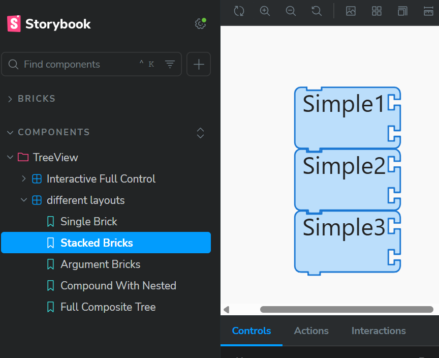
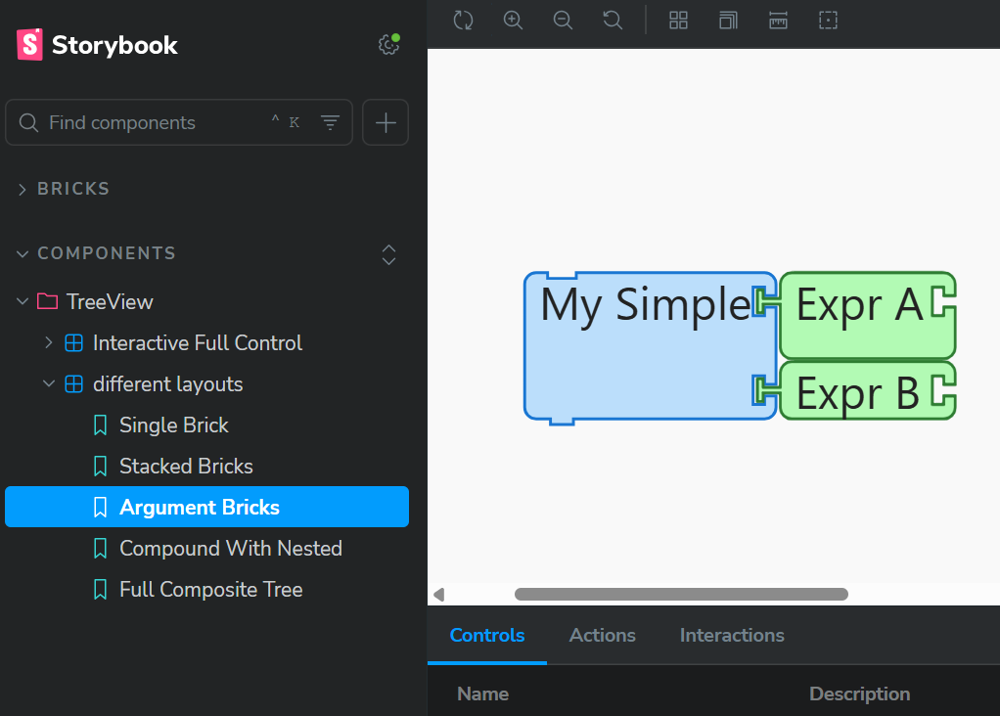
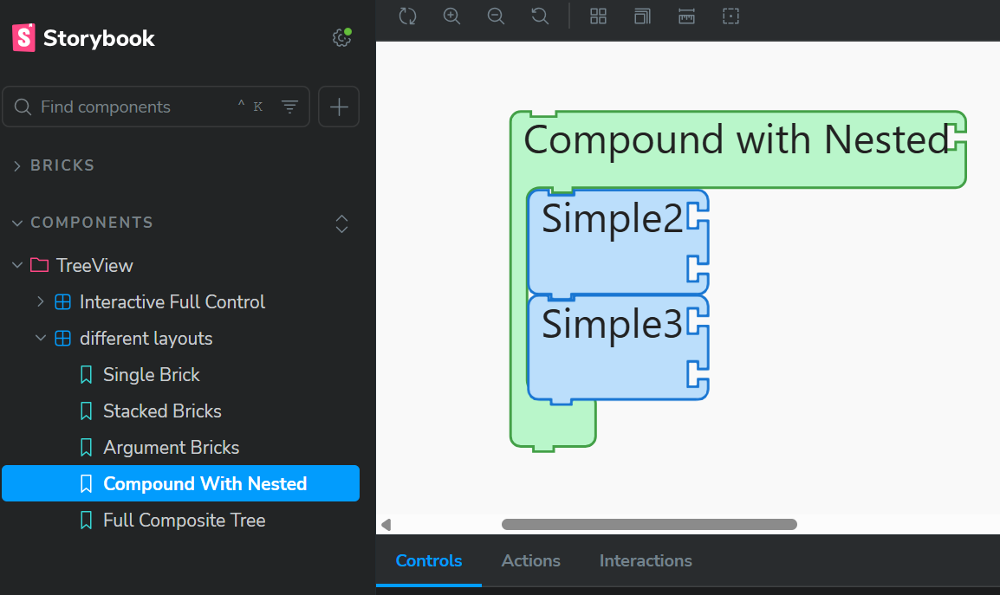
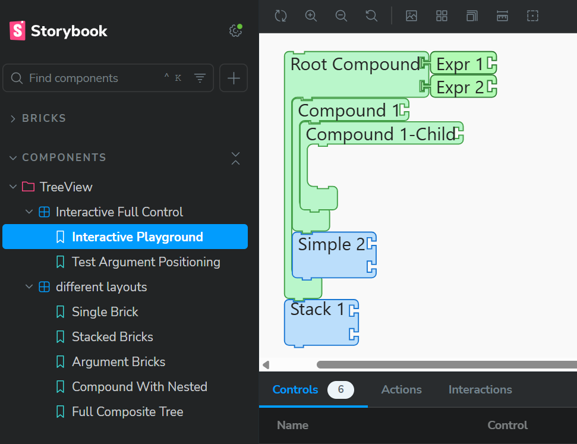
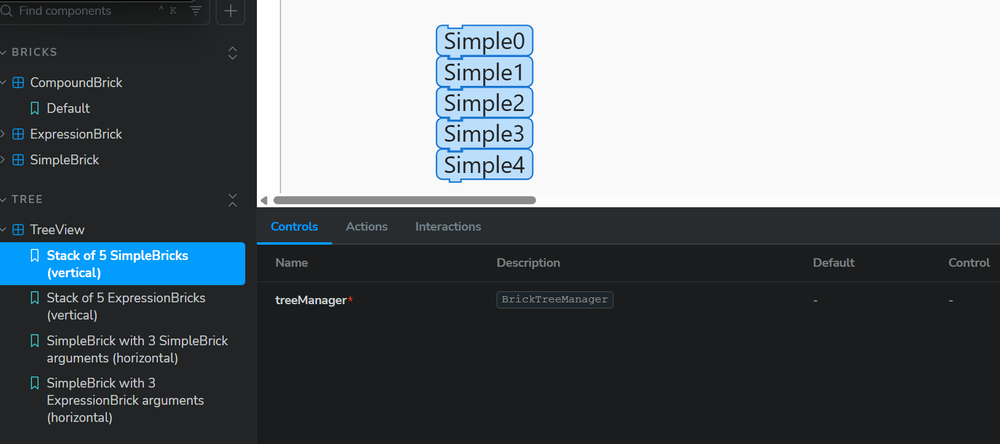
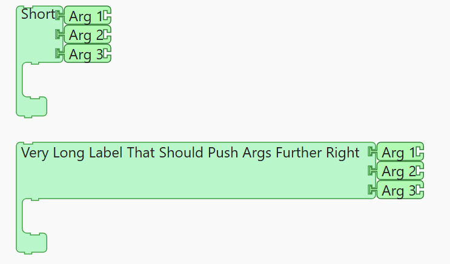

# Google Summer of Code 2025 | Sugar Labs  

  
  

## Contributor Information

- **Name:** Saumya Shahi  
- **Email:** [saumyashahi05@gmail.com]  
- **GitHub:** [saumyashahi](https://github.com/saumyashahi)  
- **Organization:** [Sugar Labs](https://www.sugarlabs.org/)
- **Blog Page:** [Saumya Shahi](https://www.sugarlabs.org/authors/saumya-shahi)  
- **Project Repository:** [musicblocks-v4](https://github.com/sugarlabs/musicblocks-v4)  
- **Mentors:** [Anindya Kundu](https://github.com/meganindya/), [Walter Bender](https://github.com/walterbender/), [Devin Ulibarri](https://github.com/pikurasa/)  
- **Project:** Large (350 hours)  

---  

## Description  

This project introduces the **Masonry Module** for Music Blocks version 4, a scalable system for generating, rendering, and manipulating lego-like **bricks** that represent musical and programming constructs. The Masonry system replaces the older, limited brick rendering logic with a modern **Model–View architecture**, **drag-and-drop playground**, and **brick-tower management** for execution.  

Students can now explore programming concepts visually, with bricks that can be **stacked, nested, connected, or disconnected** dynamically, enabling deeper reflection and experimentation in a playful environment.  

## Background  

Music Blocks is an educational visual programming environment designed to teach music and coding. While the older brick system allowed basic stacking, it lacked scalability, category organization, and seamless integration with AST execution.  

The **Masonry Module** was designed to:  
- Make brick rendering dynamic and extensible.  
- Provide an intuitive **palette** of categorized bricks.  
- Enable **drag-and-drop interactions** with real-time snapping.  
- Allow **tower formations** that map directly to program structure.  
- Bridge **visual bricks with ASTs**, making programs executable.  

[*Project Plan & Functional Requirements*](https://docs.google.com/document/d/1UJXh3734S138BoTsGulzeTlZXstyvWd6syJK2eclMKI/edit?usp=sharing)  

This aligned with Sugar Labs’ vision of combining **creativity, coding, and learning** into a single, interactive platform.  

## Goals  

- **Brick Rendering System:** Build scalable SVG-based bricks (simple, expression, compound).  
- **Model–View Architecture:** Separate data (Model) and UI (View) for modularity and debugging.  
- **Tower Management:** Implement stacking, disconnection, and traversal logic.  
- **Palette & Playground:** Create categorized palette and drag-and-drop workspace.  
- **Collision Detection:** Enable snapping and rejection for valid/invalid connection points.  
- **AST Integration:** Translate towers into AST nodes for execution by program engine.  
- **Stretch Goals:** Macros, trash handling, and UI enhancements.  

---  

## Technical Implementation  

### Phase 1: Brick Rendering with SVG  
- Designed each brick from scratch using Scalable Vector Graphics (SVGs).
- Implemented `brickFactory` for generating **Simple, Expression, and Compound** bricks.  
- Used **dynamic SVG paths** for scalable rendering with customizable properties (label, color, slots).  
- Verified in Storybook with isolated examples.  

[PR: SVG Paths for Bricks](https://github.com/sugarlabs/musicblocks-v4/pull/439)  

  
   Simple brick SVG structure

  
   Expression brick SVG structure

  
   Compound brick SVG structure

### Phase 2: Model–View Architecture  
- Built abstract `BrickModel` with shared properties.  
- Created concrete models for each `SimpleBrick`, `ExpressionBrick`& `CompoundBrick`.  
- Added React views `SimpleView`, `ExpressionView`& `CompoundView`.  
- Implemented **storybook stories** for isolated testing.
  
[PR: Add Model and View for Bricks](https://github.com/sugarlabs/musicblocks-v4/pull/441)  

  
   Example of simple stacked bricks

  
   Example of argument-based bricks with inputs

  
   A compound brick containing nested structures

### Phase 3: Building the Tower Model  
- Implemented **tower formation** using structures, each brick being an individual node.  
- Managed stacking, nesting, expression slots and merging/disconnection of towers. 
- Added DFS/BFS traversal for **dimension calculations** and **bounding box validation** of the children.  
- Returned the connection points of each brick from the `path` file to manage individual connections.
  
[PR: Add Tower Model and Connection points](https://github.com/sugarlabs/musicblocks-v4/pull/442)  

  
   Tower with multiple compound bricks and nested layers

### Phase 4: Tower View & Testing  
- Wrote React Stories for dynamic component testing
- Verified stacking, nesting, and bounding box logic in Storybook.  
- Tested rendering of towers with short/long labels and nested compounds.
- Validated correct connection points and bounding box calculation.

  
   Stacked simple bricks

  
   Validation of short vs long label rendering in bricks

### Phase 5: Palette System  
- Developed categorized palette with scrollable categories for separation.
- Added hover tooltips and search functionality for easy accessibility.  
- Tested the rendering in Storybook using a json brick registry configurations.
  
[PR: Add pallette to Masonry Module](https://github.com/sugarlabs/musicblocks-v4/pull/444)  

[Workspace view with categorized palette visible](https://github.com/user-attachments/assets/98c45d85-f680-4c22-8efe-ddf7c61143be)

### Phase 6: Drag-and-Drop Playground  
- Migrated all components to playground for combined testing.
- Integrated **React Aria DnD + Recoil** for workspace interactions.  
- Implemented **collision detection with Quadtree**, detecting connection, and slot validation.  
- Individual towers dynamically created on drop coordinates on the workspace.  
- Used reverse mapping utility to map back the collision points to respective brick and tower.
  
[PR: Add drag and drop, collision detection, and reverse mapping](https://github.com/sugarlabs/musicblocks-v4/pull/447)  

[Dragging and Dropping bricks into the workspace](https://github.com/user-attachments/assets/2c3084a7-a22c-4223-94be-07e5109334c8)

[Collision detection system to detect connection points](https://github.com/user-attachments/assets/07299e40-86b1-4496-9520-67dfbafb21a6)

### Phase 7: Disconnection Logic  
- Added ability to **disconnect towers** in real-time by dragging them away.  
- Updated bounding boxes and parent-child relationships for each brick in the tower.  
- Trigger model and dimension updates each time there is a disconnection of a brick/tower.
  
[Testing disconnection on a dummy tower](https://github.com/user-attachments/assets/a5729e87-635f-4fa3-a0bc-9075ff3cfb95)

### Phase 8: AST Integration  
- Decided on configurations required to transform the visual brick into an AST node.
- Wrote mappings for 26 AST node types (`FunctionCallStatement`, `BinaryOperatorExpression`, etc.).  
- Some brick samples were used to translate into executable AST nodes.
- Worked on bug fixes, refactoring, and collaborated on program engine integration. 
  
[PR: Add tower disconnection and dragging of tower in Workspace](https://github.com/sugarlabs/musicblocks-v4/pull/450)

---  

## Project Timeline  

| Week | Dates | Milestones & Achievements | Blog / Report Link |  
|------|-------|---------------------------|-------------------|  
| Week 1 | 2025-06-01 – 2025-06-07 | Implemented SVG brick rendering system. | [Week 1](https://www.sugarlabs.org/news/developer-news/2025-06-08-gsoc-25-saumya-week01) |  
| Week 2 | 2025-06-08 – 2025-06-14 | Added Model–View architecture and Storybook stories. | [Week 2](https://www.sugarlabs.org/news/developer-news/2025-06-14-gsoc-25-saumya-shahi-week02) |  
| Week 3 | 2025-06-15 – 2025-06-21 | Implemented Tower Model (stacking, nesting, DFS traversal). | [Week 3](https://www.sugarlabs.org/news/developer-news/2025-06-21-gsoc-25-saumya-shahi-week03) |  
| Week 4 | 2025-06-22 – 2025-07-05 | Added categorized palette with search and tooltips. | [Week 4](https://www.sugarlabs.org/news/developer-news/2025-06-29-gsoc-25-saumya-shahi-week04) |  
| Week 5-6 | 2025-07-06 – 2025-07-12 | Integrated drag-and-drop in playground with collision detection. | [Week 5-6](https://www.sugarlabs.org/news/developer-news/2025-07-06-gsoc-25-saumya-shahi-week05) |  
| Week 7–8 | 2025-07-13 – 2025-07-26 | Implemented disconnection and dynamic tower updates. | [Week 7–8](https://dummy-link-week7) |  
| Week 9–10 | 2025-07-27 – 2025-08-09 | AST integration and execution pipeline refinement. | [Week 9–10](https://dummy-link-week9) |  
| Final Blog | 2025-08-10 – 2025-08-24 | Bug fixes, documentation, final polish. | [Week 11–12](https://dummy-link-week11) |  

---  

## Results & Learnings  

- **SVG Rendering:** Built scalable, parameterized bricks with custom paths.  
- **Architecture:** Learned and applied Model–View separation for modular design.  
- **Drag-and-Drop:** Implemented React Aria DnD with real-time snapping and validation.  
- **Data Structures:** Used DFS/BFS and Quadtree for traversal and collision detection.  
- **AST Concepts:** Understood compiler pipeline while mapping bricks to AST nodes.  
- **Collaboration:** Worked closely with mentors and peers on integration and reviews.  

## Future Work  

- Full integration of **AST execution engine**.  
- Implement **macros and trash handling**.  
- Optimize for **performance on large programs**.  

## Acknowledgments  

I would like to sincerely thank:  
- **Anindya Kundu, Walter Bender, and Devin Ulibarri** for their continuous guidance and mentorship.  
- **Sugar Labs Community** for their encouragement and feedback.  

GSoC 2025 has been a transformative experience; I grew as a developer, contributed to an open-source project with global impact, and learned the importance of designing systems that are both technically robust and educationally meaningful.