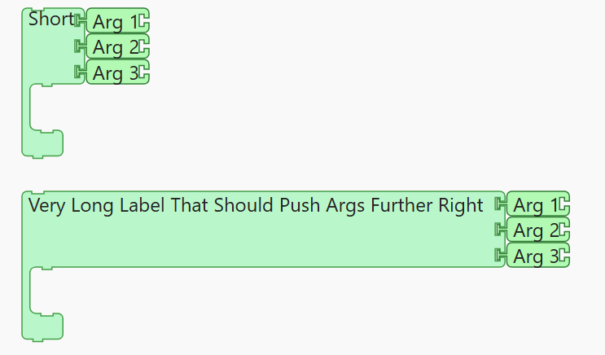
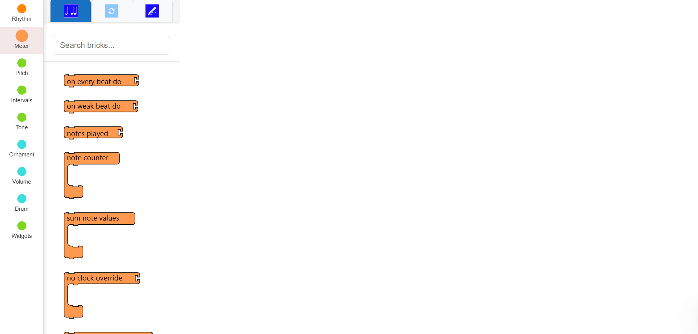
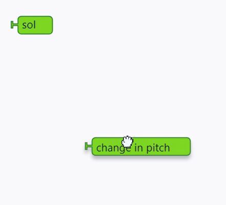
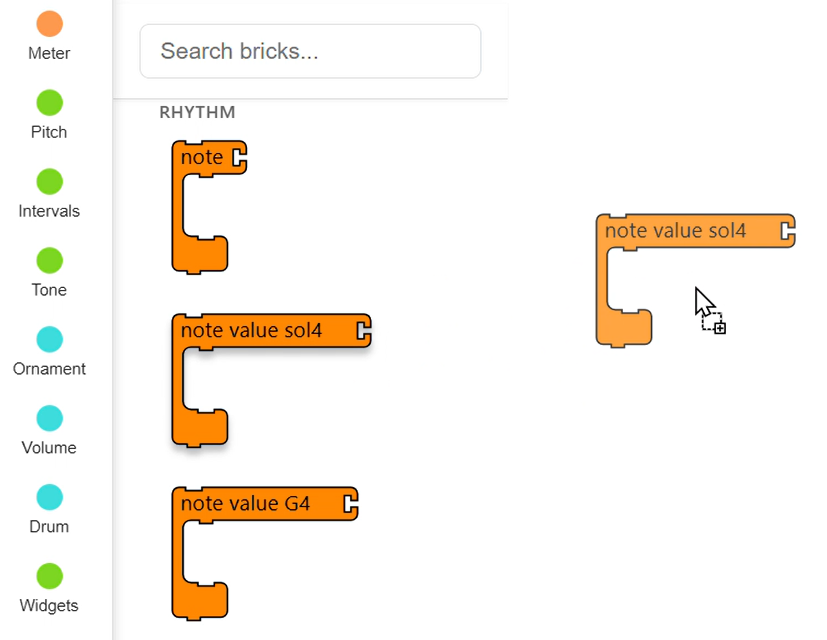
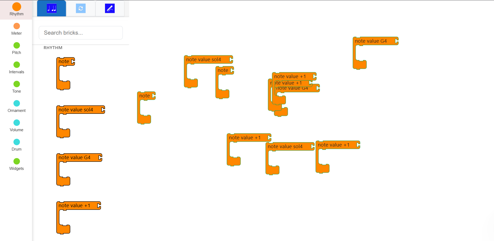
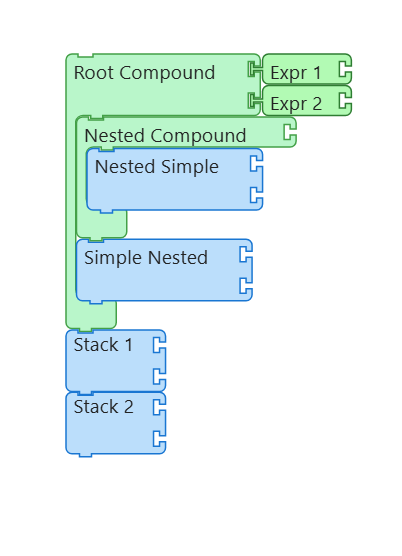
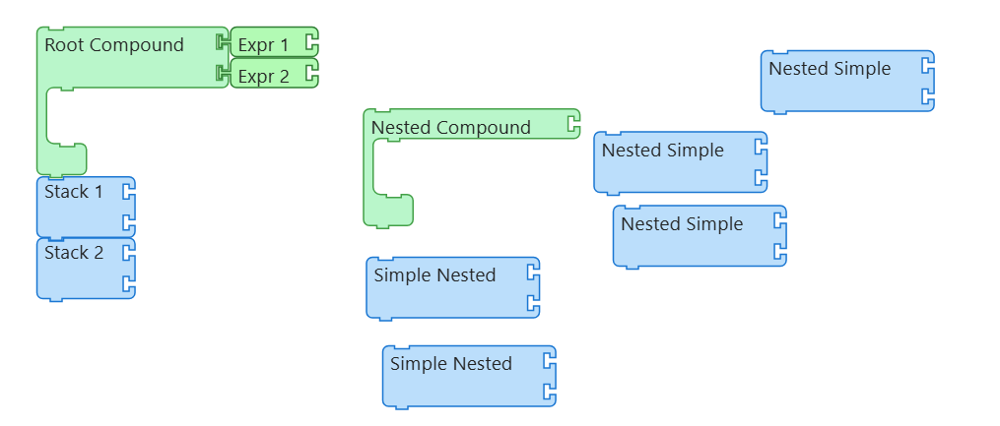

# GSoC 2025: Building the Masonry Module for Music Blocks v4
 
**Contributor**: [Saumya Shahi](https://github.com/saumyashahi)  
**Organization**: [Sugar Labs](https://github.com/sugarlabs/)  
**Project**: Music Blocks: Masonry Module v4  
**Repository**: [musicblocks-v4](https://github.com/sugarlabs/musicblocks-v4)  
**Mentors**: [Anindya Kundu](https://github.com/meganindya/), [Walter Bender](https://github.com/walterbender/), [Devin Ulibarri](https://github.com/pikurasa/)  

In Summer 2025, I contributed to **Music Blocks**, an educational visual programming environment developed by *Sugar Labs*. My project—**The Masonry Module**—focused on creating a scalable system for generating, rendering, and manipulating lego-like “bricks” that represent musical and programming constructs.  

Over **12 weeks**, I:  
- Engineered a **dynamic SVG-based brick rendering system**.  
- Built a **categorized palette** for intuitive brick discovery.  
- Integrated **drag-and-drop functionality** with real-time snapping.  
- Designed logic for **tower formation** and connection/disconnection.  
- Implemented **AST translation**, bridging UI with the execution engine.  

## Chapter 1: The Blueprint (Community Bonding)  
During community bonding, I collaborated with my mentors and fellow contributors to define the project scope. Together, we finalized the **Minimum Viable Product (MVP)**:  
- Rendering visually distinct brick types (*simple, expression, and compound*).  
- A **configurable generation system** for dynamic brick creation.  
- A categorized **palette with drag-and-drop** functionality.  
- **Tower connections/disconnections** with initial AST translation.  

Stretch goals included macros, trash handling, and UI enhancements.  
[*Project Plan & Functional Requirements*](https://docs.google.com/document/d/1UJXh3734S138BoTsGulzeTlZXstyvWd6syJK2eclMKI/edit?usp=sharing)  

## Chapter 2: Crafting the Bricks  
The foundation of the module was **brick design via SVG**. I designed and implemented three distinct visual types:  
- **Simple Bricks** – Stackable, linear sequences with optional parameters.  
- **Expression Bricks** – Parameterized bricks used as arguments.  
- **Compound Bricks** – Bricks that enclose sequences of other nested bricks.  

The `brickFactory` encapsulates the dynamic generation of these bricks, allowing customization of properties like color, label, and connection notches. This system ensures scalability and flexibility for future brick types.  

  
   
  Example of simple stacked bricks

  
   
  Example of argument-based bricks with inputs

  
   
  A compound brick containing nested structures

## Chapter 3: Generalizing Brick Creation  
To make the system **scalable**, I developed a **dynamic brick generator** driven by parameters. This allowed bricks like to be auto-generated with different argument values passed. The generator also validates connection notches to ensure compatibility between bricks.  

## Chapter 4: Building Tower Model  
I implemented **tower formation**—tree like formations with one or multiple bricks representing programing logic. I developed a model that can manage:  
- **Connection logic**: Stacking, slot validation, and expression nesting.  
- **Disconnection logic**: Splitting a tower into valid sub-towers.  
- **DFS traversal**: Calculate dimensions from leaf node to parent, but render in reverse for correct selection of bricks according to the bounding box.

The `towerUtils` provides utility functions for managing node relationships and calculating nested dimensions, ensuring robust tower management.  

  
   
  Tower with multiple compound and nested layers

To support these behaviors, I also implemented a **collision detection system** that allows towers and bricks to connect or reject correctly:  
- Each brick exposes a **bounding box** (`x, y, width, height`) dynamically calculated during render.  
- On drag, the system continuously checks **overlaps** between the dragged brick’s connection points and potential target slots using **Quadtree** collision detection logic.  
- If the overlap is within a defined **tolerance threshold**, the slot is highlighted as a valid connection point.  
- Otherwise, the brick is rejected and rendered back to its last valid position.  

This real-time collision detection was the backbone for both stacking and disconnection logic, ensuring the playground feels fluid and natural.  

[Collision detection system to detect connection points](https://github.com/user-attachments/assets/07299e40-86b1-4496-9520-67dfbafb21a6)

## Chapter 5: Testing the Tower View  
Using the tower model, I had previously written I got the towers rendered, and verified individual components in storybook:  
- **Stacking bricks**: Rendered simple bricks with stacking, dynamically increasable.  
- **Nested area calculation verification**: Rendered a root compound brick with multiple nested layers, validating bounding box calculations and correct traversals.  
- **Expression bricks**: Validated correct connection points for expression bricks connection with short and long labels.  

  
   
  Example of simple stacked bricks

  
   
  A nested compound brick with multiple levels

  
   
  Validation of short vs long label rendering in bricks

## Chapter 6: Building the Palette  
A **categorized palette** that organizes all available bricks into categories along with a fellow contributor. Features include:  
- Having scrollable bricks palette  
- Hover tooltips with descriptions.  
- Category headers for easy scanning.  
- Each brick being a draggable component.  
- Easy search with search button  

The `paletteWrapper` manages category selection, search filtering, and dynamic updates, creating an intuitive entry point for users.  

  
   
  Workspace view with categorized palette visible

## Chapter 7: Drag-and-Drop in the Playground  
Integrating all components into the **main playground**, I used **React Aria DnD + Recoil** to enable:  
- Dragging from the palette to the workspace.  
- Repositioning bricks within the workspace.  
- Real-time snapping and rejection indicators.  

The `WorkspaceView` handles drag-and-drop events, dynamically creating individual towers at drop coordinates.  
<!-- 

  
   
  Dragging a brick into the workspace

  
   
  Dropping a brick into the workspace

 
-->

  
   
  Workspace with a number of dropped bricks

[Dragging and Dropping bricks into the workspace](https://github.com/user-attachments/assets/2c3084a7-a22c-4223-94be-07e5109334c8)

## Chapter 8: Brick Disconnections in Playground  
Using a dummy rendered tower, I implemented disconnection real-time, using the model written:  
- Dragging from the palette to the workspace.  
- Repositioning bricks within the workspace.  
- Real-time snapping and rejection indicators.  

The `TowerView` handles creating separate towers bricks dynamically, updating all connections, bounding box calculations and parent-child relationships when there is a change in a tower structure.  

  
   
  A basic dummy tower for testing tower model logic

  
   
  valid disconnections with sub-tower creation

[Testing disconnection on a dummy tower](https://github.com/user-attachments/assets/a5729e87-635f-4fa3-a0bc-9075ff3cfb95)

## Chapter 9: Bridging to ASTs  
The final step was mapping towers to **Abstract Syntax Trees (ASTs)** for execution.  
- Wrote all configurations required for translating each visual brick into an AST node.  
- Supported 26 AST node types, for e.g. `FunctionCallStatement`, `BinaryOperatorExpression`, etc.  
- Collaborated with peers to refine the execution pipeline.  

## Chapter 10: Next Steps  
- Complete integration of AST and execution (program) engine.  
- Add advanced features: rendering macros and trash handling.  
- Optimize performance for large-scale programs.  

## Epilogue: Reflections  
> GSoC 2025 has been a transformative experience: I grew as a developer, contributed to an open-source project with global impact, and learned the importance of designing systems that are both technically robust and educationally meaningful. My deepest thanks to mentors **Anindya Kundu, Walter Bender, and Devin Ulibarri** for their guidance. Special appreciation to **Justin Charles** for collaboration. The Sugar Labs community made this journey collaborative and inspiring.  
